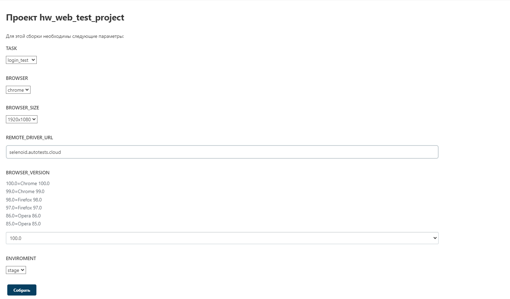
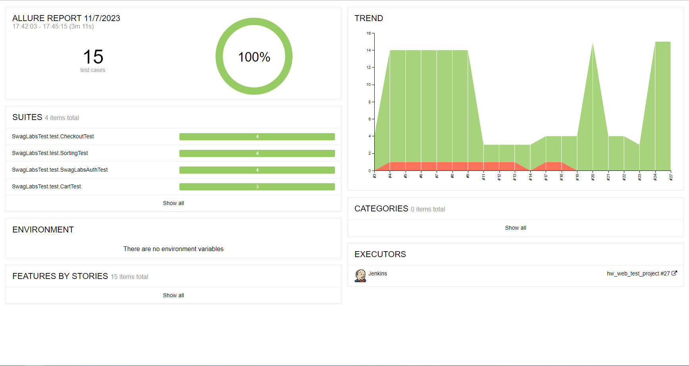
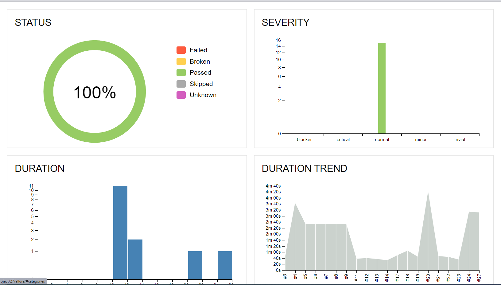
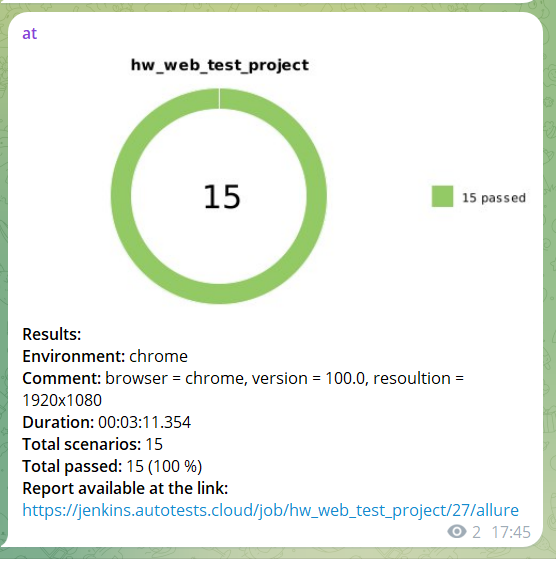

# Проект по автоматизации тестирования web приложения 

## 	Содержание

> ➠ [Покрытый функционал](#покрытый-функционал)
>
> ➠ [Технологический стек](#технологический-стек)
>
> ➠ [Запуск тестов из терминала](#запуск-тестов-из-терминала)
>
> ➠ [Запуск тестов в Jenkins](#-удаленный-запуск-тестов-в-Jenkins)
>
> ➠ [Отчет о результатах тестирования в Allure Report](#-главная-страница-allure-отчета)
>
> ➠ [Уведомления в Telegram с использованием бота](#-уведомления-в-telegram-с-использованием-бота)
>
> ➠ [Пример запуска теста в Selenoid](#-пример-запуска-теста-в-selenoid)

##  Покрытый функционал

> Разработаны автотесты на <code>UI</code>.
### UI

- [x] Авторизация в веб приложении
- [x] Проверка сортировки товаров
- [x] Добавление товаров в корзину
- [x] Оформление заказа

## Технологический стек

### В данном проекте автотесты написаны на <code>Java</code> с использованием <code>Selenide</code> для UI-тестов.
>
> <code>Selenoid</code> выполняет запуск браузеров в контейнерах <code>Docker</code>.
>
> <code>Allure Report</code> формирует отчет о запуске тестов.
>
> Для автоматизированной сборки проекта используется <code>Gradle</code>.
>
> В качестве библиотеки для модульного тестирования используется <code>JUnit 5</code>.
>
> <code>Jenkins</code> выполняет запуск тестов.
>
> После завершения прогона отправляются уведомления с помощью бота в <code>Telegram</code>.

## Запуск тестов из терминала

### Локальный запуск тестов

##  Удаленный запуск тестов в Jenkins

> Для запуска тестов используется параметризированная сборка

##  Главная страница allure отчета

###  Группировка тестов по проверяемому функционалу

###  Основной дашборд

##  Уведомления в Telegram с использованием бота

> После завершения сборки специальный бот, созданный в <code>Telegram</code>, автоматически обрабатывает и отправляет сообщение с отчетом о прогоне.
>
> Информация по настройке и использованию бота <code>https://github.com/qa-guru/allure-notifications</code>

##  Пример запуска теста в Selenoid

> К каждому тесту в отчете прилагается видео. Одно из таких видео представлено ниже.

